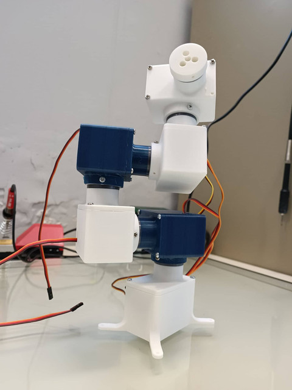
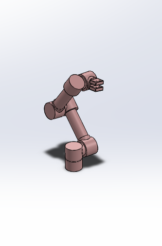
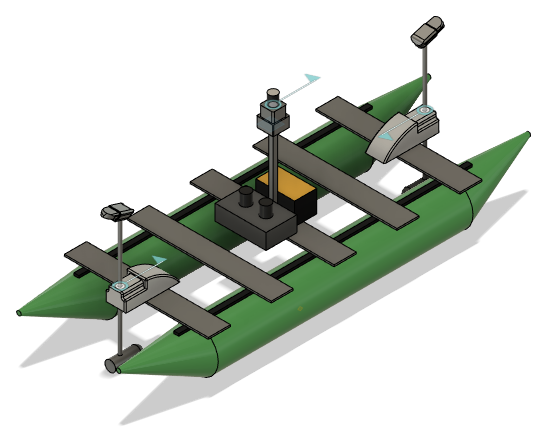
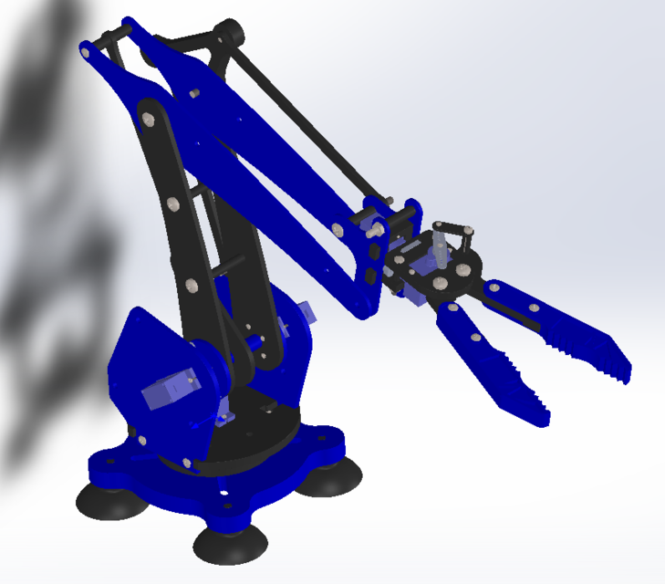

<h1 align="center">Hi 👋, I'm Dimitrios Bouzoulas</h1>

    

<h3 align="center">I like writing code that makes robots move and perceive the world better!</h3>

 

- 🔭 I’m currently working on **autonomous vehicles applications**

- 🌱 I’m currently learning **application deployment & backend**

- 💬 Ask me about **how to design and them make things move**

- 📫 How to reach me **<a href="https://www.linkedin.com/in/dimitrios-bouzoulas-204664182/"> LinkedIn <a/>**

- :loudspeaker: The rest of my socials can be found **<a href="https://linktr.ee/dimitrios_bouzoulas"> here <a/>**
 

<h2>:octocat: My Top Open Source Projects</h2>

  <!-- Example: This card is for your "Qlearning-Pong-Workshop-in-Cpp" repo -->
    
     
    
     
        

<h2>:art: My CAD Projects</h2>

<!-- 2x2 Grid of Cards with table border removed -->
<table align="center" style="border: none; border-collapse: collapse;">
  <tr style="border: none;">
    <!-- Card #1 -->
    <td style="border: none;">
      

        
        

          <strong>
            <a href="https://grabcad.com/library/multiple-degree-robotic-arm-1-6-dof-1">
              Modular Robotic Arm
            </a>
          </strong>
        

      

    </td>
    <td style="border: none;">
      

        
        

          <strong>
            <a href="https://grabcad.com/library/sample-robotic-arm-manipulator-1">
              Minimalistic Modular Robot Arm
            </a>
          </strong>
        

      

    </td>
  </tr>

  <tr style="border: none;">
    <!-- Card #2 -->
    <td style="border: none;">
      

        
        

          <strong>
            <a href="https://grabcad.com/library/aboat_project_simulation_model-1">
              Autonomous Boat Model
            </a>
          </strong>
        

      

    </td>  
    <!-- Card #3 -->
    <td style="border: none;">
      

        
        

          <strong>
            <a href="https://grabcad.com/library/basic-robotic-arm-1">
              2 DOF Robotic Arm
            </a>
          </strong>
        

      

    </td>
    </tr>
    <!-- Card #4 -->
</table>

<h3 align="left">Languages and Tools:</h3>

       <a href="https://www.linux.org/" target="_blank" rel="noreferrer"> 
 
 </a>        

 

<h3 align="left">Thank you for visiting have a rickroll <3</h3>

 

  

 

<!-- 

  
   
  
  
  

 -->

<!-- <h3 align="left">Connect with me:</h3>

 -->
